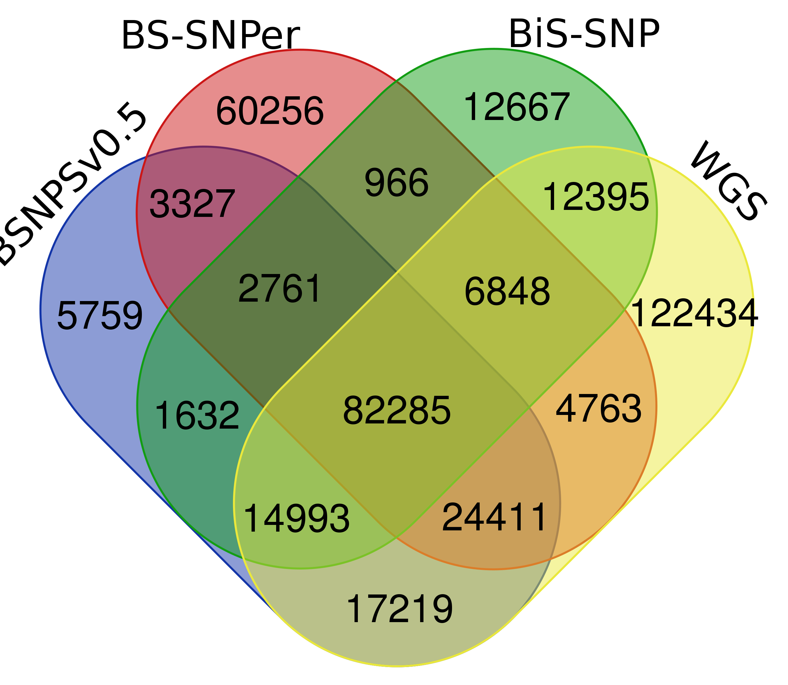
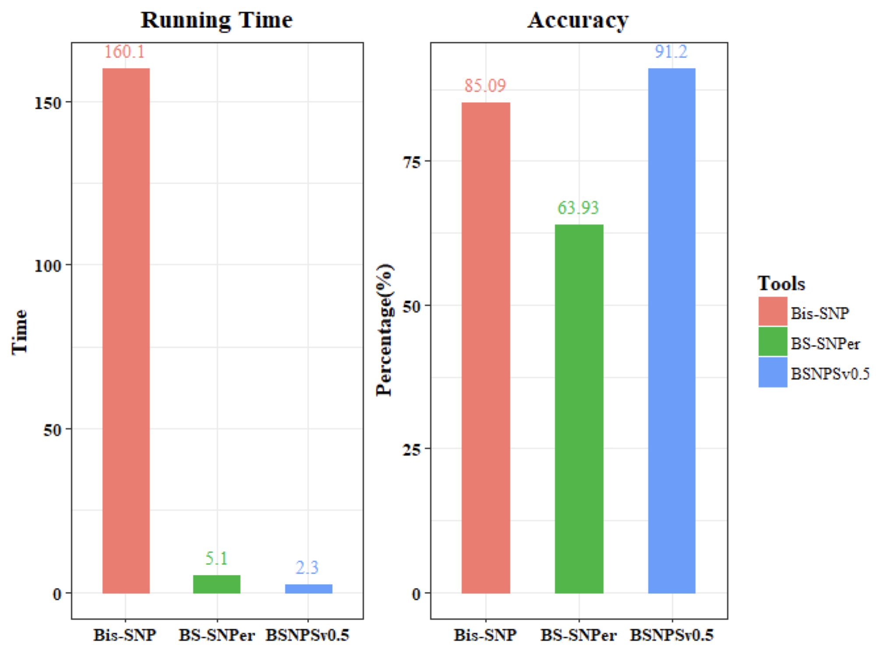
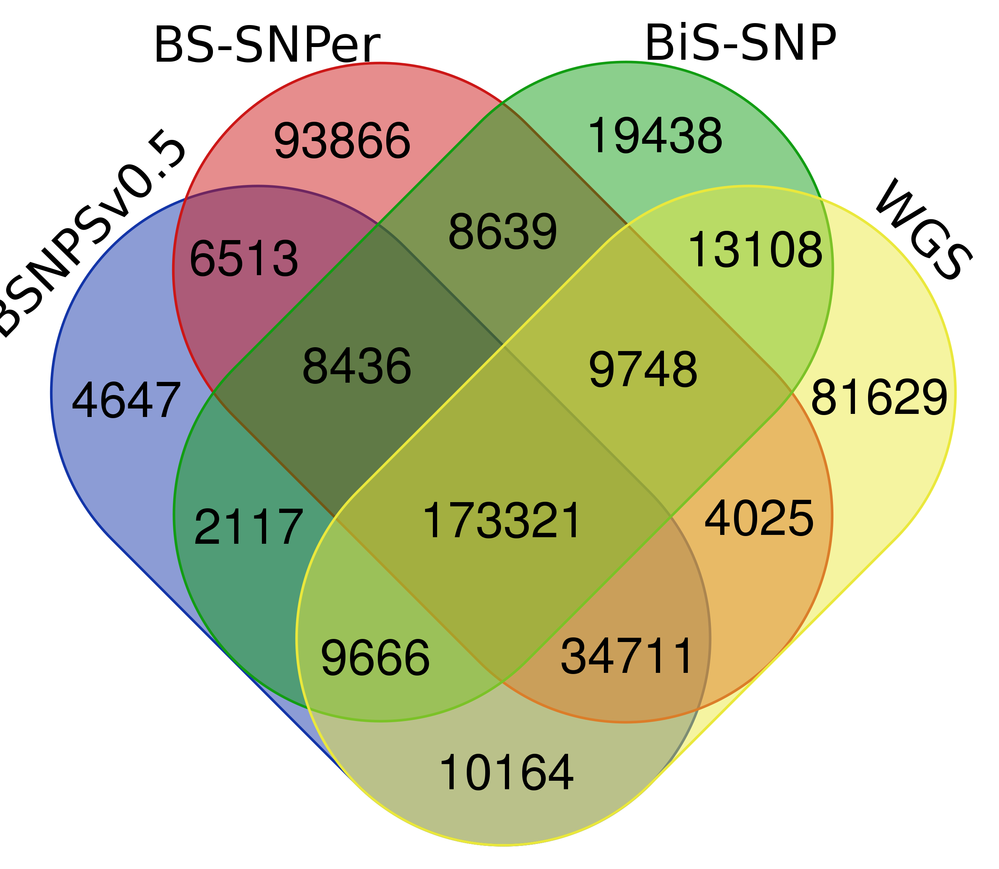
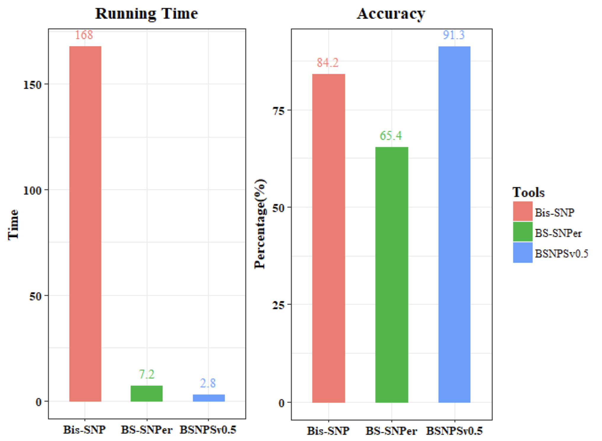

  
  
  
  
  

  
  
  
  

# Bisulfite-seq Variation Calling (BSVC)

## INSTALL
make

./bsvc

Rename BSsnpcaller/BSNPS to BSVC

:smile: We currently do not have plans to publish bsvc. If you are using bsvc, please cite https://github.com/ZhouQiangwei/bsvc

## Methods

**Bayes:** bayes genotype function, likehood function.

Genotype: Bayesian modeling $P(G|D)$

$P(G|D) = P(G) * P(D|G) / P(D)$

The prior distribution of the genotype: $P(G)$

Likelihood: $P(D|G)$, probability of observing reads $D$ given genotype $G$

$P(D│G)= ∏^n_{(i=1)}P(D_i |G)$

Where $i=1, 2, …, n$, and n is the number of reads.

Genotypes: $AA, AT, AC, AG, TT, TC, TG, CC, CG, GG$

#### lilelihood function

The likelihood function need consider bisulfite treatment in BS-Seq data. The details showed in below:

P: probability of the corresponding base call is correct

Q: probability of the corresponding base call is incorrect

wN: waston strand, N is A/T/C/G

cN: crick strand, N is A/T/C/G

#### Available base in BS-seq data:

| Base | Waston  |  Crick  |
| :--: | :-----: | :-----: |
|  T   |    T    |    T    |
|  C   | Cm / Tu |    C    |
|  A   |    A    |    A    |
|  G   |    G    | Gm / Au |

BS-Seq data table of waston and crick bases in the sequencing read. m stands for methylated and u stands for unmethylated. We can see if there is a conflict between different bases according to this table, then calculated the mutation probability. 

For example, if we want to calculate the mutation probability of C to T, it can be seen that both C and T have T in the waston strand, as shown in the following table. We mark the conflicting information in blue and available information in red. Therefore, the C to T mutation probability formula is: $crickT / ( crickT + crickC)$.  

<table><tbody>
    <tr>
        <th>Base</th><th>Waston</th><th>Crick</th>
    </tr>
    <tr>
        <td>C</td>
        <td>Cm / Tu</td>
        <td>C</fontfont></td>
    </tr>
    <tr>
        <td>T</td>
        <td>T</td>
        <td>T</fontfont></td>
    </tr>
</table>

**SNP condition in BS-Seq data**

| **Type  of mutation** | **Mutation  frequency**       | √    |
| --------------------- | ----------------------------- | ---- |
| A>T                   | T  reads / Total reads        |      |
| A>C                   | (C+WsT)  reads / Total reads  |      |
| A>G                   | WsG  reads / (WsG+WsA)  reads |      |
| T>A                   | A  reads / Total reads        |      |
| T>C                   | CrC  reads / (CrT+CrC)  reads |      |
| T>G                   | (G+CrA)  reads / Total reads  |      |
| C>A                   | A  reads / Total reads        |      |
| C>T                   | CrT  reads / (CrC+CrT)  reads |      |
| C>G                   | (G+CrA)  reads / Total reads  |      |
| G>A                   | WsA  reads / (WsA+WsG)  reads |      |
| G>T                   | T  reads / Total reads        |      |
| G>C                   | (WsT+C)  reads / Total reads  |      |

## Results

### 

**Modify:** add pvalue by fisher's exact test

> float  fishers_exact(int expValue1, int expValue2, int obsValue1, int obsValue2)
>
> Calculates significance of variants
>
> Parameters:
>
> expValue1 - Total reads depth * Q
>
> expValue2 - Total reads depth
>
> 1th of variant (observed)
>
> obsValue2 - Total reads depth (observed)
>
> Returns:
>
> double, P-value from Fisher's Exact Test
>
> Q: probability of sequence error,  $0.1^{(AverQual/10)}/3$ 

**Modify:**  1, If variant position filter quality is Low, we also can set `AD>minvarread, ALFR>minvarrate, pvalue < pvalue_cutoff + 0.01` as PASS.

AD, Total allelic depths

ALFR, Allele frequency

default, set minvarread = 5, minvarrate = 0.3.

if `AD>minvarread, ALFR>minvarrate, pvalue < pvalue_cutoff + 0.01` is true:

​	9882

validated by WGS: 

​	9212 (93.2%)

**Modify:  ** 2, add multi-thread

**Modify:  ** 3, add t test

**Results**:

| Tools                                            | number of SNPs | overlap with WGS   |
| ------------------------------------------------ | -------------- | ------------------ |
| BS-SNPer                                         | 185617         | 118307 (63.7%)     |
| BSsnpcaller (BSNPS)                              | 152387         | **138908 (91.2%)** |
| BSsnpcaller(with bis-snp realign and recall bam) | 153972         | **141836 (92.1%)** |
| BiS-SNP                                          | 134547         | 116521 (86.6%)     |
| Bis-SNP (realign + recall)                       | 145649         | **136946 (94.0%)** |
| WGS                                              | 285348         |                    |

### Used time

| Tools                      | Thread x1 (hours) | Thread x4 (hours) |
| -------------------------- | ----------------- | ----------------- |
| BS-SNPer                   | 5.1               | N                 |
| BSsnpcaller (BSNPS)        | **2.3**           | **0.56**          |
| BiS-SNP                    | 152.1             | 64.2              |
| BiS-SNP (realign + recall) |                   | 160.2 h           |

-------------------------

## Results 2 [Sample: GM12878]

**WGS SNP** from 1000 project (Ilmn150bp300x) （GATK）

| Tools               | number of SNPs | overlap with WGS   |
| ------------------- | -------------- | ------------------ |
| BS-SNPer            | **339259**     | 221805 (65.4%)     |
| BSsnpcaller (BSNPS) | 249575         | **227862 (91.3%)** |
| BiS-SNP             | 244473         | 205843 (84.2%)     |
| WGS                 | 336372         |                    |

### Used time

| Tools               | Thread x1 (hours)                 | Thread x4 (hours) |
| ------------------- | --------------------------------- | ----------------- |
| BS-SNPer            | 7.2                               | N                 |
| BSsnpcaller (BSNPS) | **2.8**                           | **0.95**          |
| BiS-SNP             | not finished (only finished chr1) | not finished      |

